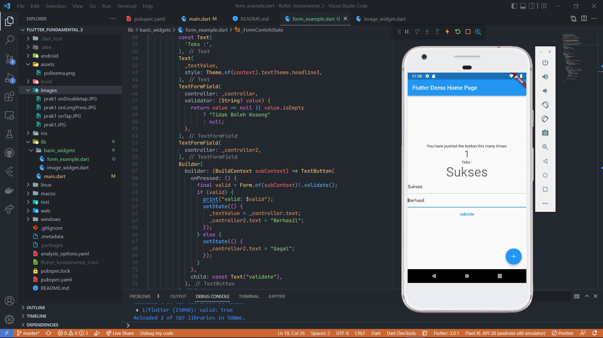
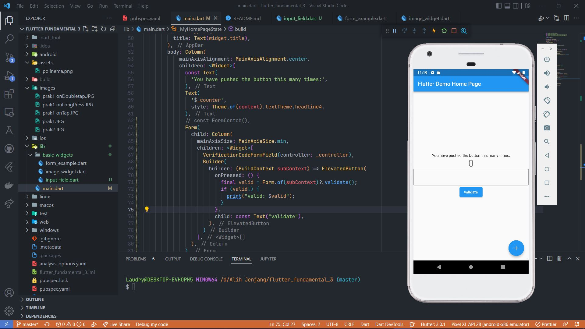

# Flutter Fundamental Part 3
### Praktikum 1

Gesture Detector

onTap

onDoubleTap

onLongPress

Keterangan : widget GestureDetector berfungsi untuk mengeksekusi berbagai macam deteksi gesture pada layar. contohnya seperti gambar diatas dan masih banyak lagi. 

### Praktikum 2

Input Widget

Keterangan : pada textformfile1 terdapat validasi jika null akan terdapat pesan "tidak boleh kosong". pada textformfile2 adalah untuk menyimpan pesan hasil validasi. jika validasi benar maka di textformfile2 akan berisi text "berhasil", jika validasi gagal maka akan terdapat pesan "Gagal"

### Praktikum 3

Custom Input dan FormField Widget

Keterangan : Pada gambar diatas inputan harus berupa angka, tidak bisa berupa String. lalu pada line 32 terdapat keyboardType number. jadi ketika textfield di klik maka keyboard di akan muncul berupa angka semua seperti gambar di atas.

